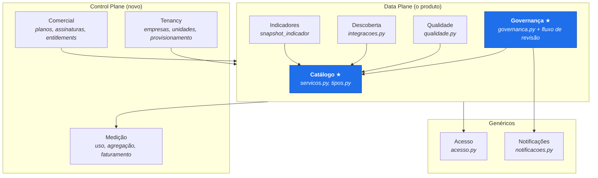
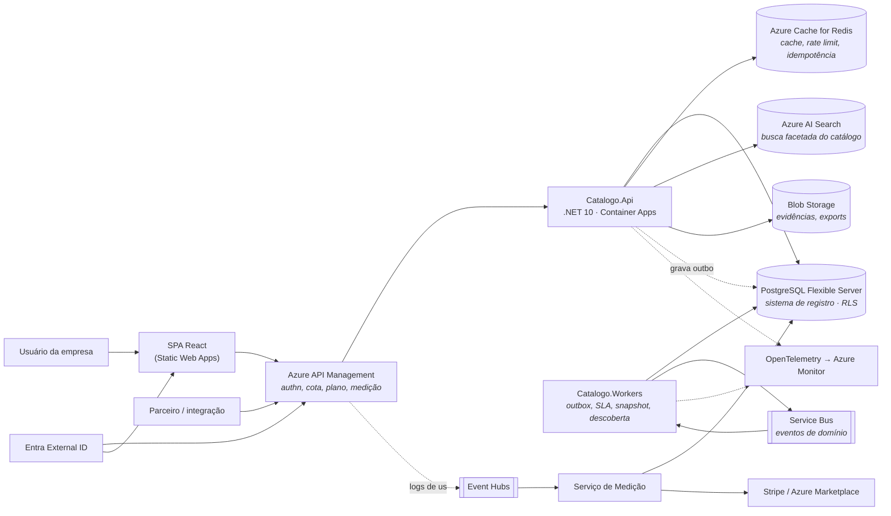
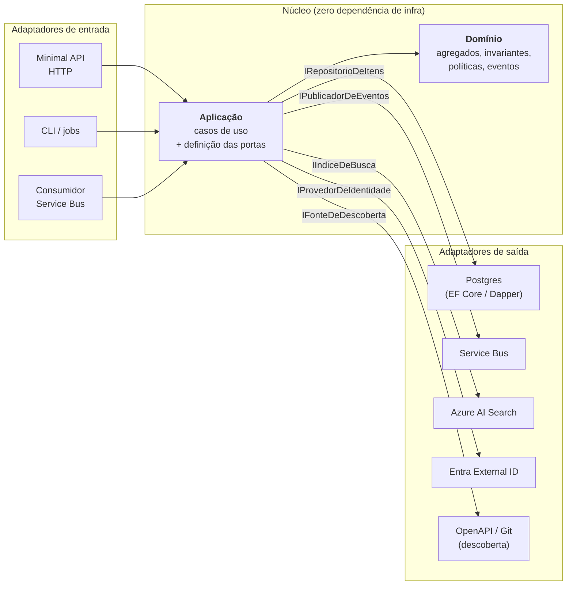

# Arquitetura — Catálogo Corporativo DDD como plataforma multiempresa

> Documento-guarda-chuva. As decisões individuais, com contexto e alternativas
> descartadas, estão em [`docs/adr/`](adr/README.md). Este arquivo amarra tudo:
> princípios, contextos delimitados, topologia, estrutura de pastas e roteiro.

**Status:** proposta · **Data:** 2026-09-22 · **Alvo:** Azure · **Núcleo:** .NET 10 (C#) · **Front:** TypeScript/React

---

## 1. Ponto de partida e problema

O `painel-ddd` hoje é um monólito Flask + SQLite de ~7.500 linhas, com SQL cru,
telas server-rendered em Jinja e uma API JSON interna. Ele é bem fatiado por
responsabilidade (`governanca.py`, `qualidade.py`, `acesso.py`, `servicos.py`,
`integracoes.py`, `notificacoes.py`) e tem decisões de modelagem maduras:

- **item genérico + metamodelo** (`item_catalogo` + `tipos.py`), em vez de uma tabela por tipo;
- **revisão imutável com hash SHA-256** e trilha de auditoria;
- **RBAC com escopo** (`global | dominio | squad`) e um ponto único de autorização (`acesso.pode`);
- **outbox** para notificação, gravada na transação do fato gerador;
- **segregação de função** na validação (quem submete não decide).

Esses cinco pontos são o ativo mais valioso do projeto e **devem sobreviver à
migração**. O que não sobrevive é a forma como estão implementados: regra de
negócio e acesso a dados no mesmo corpo de função, `sqlite3.Connection` como
primeiro parâmetro de quase toda função de domínio, e nenhuma noção de "empresa".

### O que muda ao virar produto multiempresa

| Hoje | Alvo |
|---|---|
| Uma instalação, um catálogo | N empresas, cada uma com suas unidades |
| Taxonomia fixa em `tipos.py` (código) | Metamodelo configurável por empresa (dado) |
| Identidade local (`pessoa.login`) | Entra External ID + federação com o IdP de cada cliente |
| SQLite arquivo local | PostgreSQL gerenciado, RLS, pool de conexões |
| API interna sem contrato | API pública versionada, com plano e cota |
| Sem receita | Assinatura por empresa + medição de uso por serviço |
| `python run.py` | IaC + pipeline + ambientes + observabilidade |

---

## 2. Princípios de arquitetura

Estes princípios são o critério de aceite de qualquer PR. Quando uma decisão
futura conflitar com um deles, abra um ADR — não abra uma exceção silenciosa.

1. **O domínio não conhece o mundo.** O projeto `Catalogo.Dominio` não referencia
   banco, HTTP, fila, nuvem ou framework. Se precisar de algo de fora, declara uma
   *porta* (interface) e alguém de fora implementa o *adaptador*. Garantido por
   teste de arquitetura, não por disciplina ([ADR-0001](adr/0001-arquitetura-hexagonal-ddd.md)).
2. **`tenant_id` não é parâmetro, é contexto.** Nenhuma assinatura de caso de uso
   recebe `tenant_id` de quem chama. Ele vem do token, é resolvido no middleware e
   é imposto no banco por Row-Level Security. Um bug de aplicação não pode virar
   vazamento entre empresas ([ADR-0003](adr/0003-modelo-multi-tenancy.md)).
3. **Autorização em um lugar só.** O princípio já existente em `acesso.pode()` é
   promovido a serviço de domínio puro. A rota nunca decide; ela pergunta
   ([ADR-0007](adr/0007-identidade-autenticacao-autorizacao.md)).
4. **Estado de negócio é transacional; efeito colateral é outbox.** Nada de
   publicar em fila dentro de um `try` torcendo para dar certo
   ([ADR-0008](adr/0008-outbox-mensageria.md)).
5. **O contrato público é o produto.** A API é versionada, o OpenAPI é gerado do
   código e quebrar contrato exige nova versão, não um deploy
   ([ADR-0009](adr/0009-api-publica-versionamento.md)).
6. **Fronteira lógica antes de fronteira de rede.** Contexto delimitado vira
   módulo isolado primeiro; vira processo separado só quando houver motivo
   mensurável ([ADR-0006](adr/0006-topologia-de-servicos.md)).
7. **Nada é provisionado à mão.** Se não está no Terraform, não existe
   ([ADR-0011](adr/0011-infraestrutura-como-codigo.md)).

---

## 3. Contextos delimitados

O código atual já sugere as costuras. Mapeando módulo → contexto:



★ = **domínio central**. É onde vive a vantagem competitiva e onde vale investir
em modelagem rica. Os demais são de suporte ou genéricos — aceite bibliotecas,
serviços prontos e modelos anêmicos onde fizer sentido.

| Contexto | Origem no código atual | Classificação | Extração para serviço próprio |
|---|---|---|---|
| Catálogo | `servicos.py`, `tipos.py`, `schema.sql` | Central | Nunca (é o núcleo) |
| Governança | `governanca.py`, `servicos.submeter/decidir/publicar` | Central | Tardia, se algum dia |
| Qualidade | `qualidade.py` | Suporte | Fase 3 — CPU-bound, cadência própria |
| Descoberta | `integracoes.py` | Suporte | **Fase 2 — primeiro candidato** |
| Indicadores | `snapshot_indicador`, `servicos.indicadores` | Suporte | Fase 3 — perfil de leitura distinto |
| Acesso | `acesso.py` | Genérico + suporte | Parte vai p/ Entra; papéis escopados ficam |
| Notificações | `notificacoes.py` | Genérico | **Fase 2 — acoplamento quase zero** |
| Tenancy / Comercial / Medição | *não existe* | Suporte (control plane) | Nasce separado |

---

## 4. Visão de contêineres (C4 nível 2)



---

## 5. O hexágono, concretamente



**A regra de dependência é uma seta só:** tudo aponta para dentro. Os adaptadores
implementam interfaces declaradas na camada de aplicação; o domínio não sabe que
eles existem. O único lugar que conhece todo mundo é o `Bootstrap` (composition root).

### Exemplo do ganho, com código real do projeto

Hoje, `governanca.pre_check(con, id_item)` mistura três coisas: buscar dados,
aplicar regra e formatar bloqueios. Ela só roda com um banco montado, e por isso
os testes precisam de `seed`. No alvo:

```csharp
// Catalogo.Dominio — puro, sem banco, testável em microssegundos
public sealed record ResultadoPreCheck(bool Aprovado, IReadOnlyList<CodigoDeBloqueio> Bloqueios);

public sealed class PoliticaDePublicacao
{
    public ResultadoPreCheck Avaliar(Ativo ativo, PoliticaDeGovernanca politica,
                                     ScoreDeQualidade score, IReadOnlyList<Relacao> relacoes)
    { /* as mesmas regras de governanca.py, sem `con` */ }
}
```

```csharp
// Catalogo.Aplicacao — orquestra: carrega pelas portas, chama a política, persiste
public sealed class SubmeterAtivo(IRepositorioDeAtivos ativos, IPoliticasDeGovernanca politicas,
                                  IAvaliadorDeQualidade qualidade, IUnidadeDeTrabalho uow)
{ /* ... */ }
```

A `PoliticaDePublicacao` vira testável com uma tabela de casos, sem `tmp_path`,
sem `seed`, sem `create_app`. A suíte de `test_governanca.py` — hoje o teste mais
caro do repositório — passa a rodar em memória.

---

## 6. Estrutura de pastas do repositório

```
painel-ddd/
├── docs/
│   ├── ARQUITETURA.md            ← este arquivo
│   ├── MODELO.md                 ← preservar: vira a base do metamodelo (ADR-0005)
│   ├── CARTILHA.md
│   └── adr/                      ← ADR-0001..0012
│
├── src/
│   ├── dominio/
│   │   └── Catalogo.Dominio/            # agregados, VOs, eventos, políticas. ZERO NuGet de infra.
│   │       ├── Catalogo/                #   Ativo, Relacao, Trilha, Metamodelo
│   │       ├── Governanca/              #   PoliticaDePublicacao, CicloDeVida, Validacao
│   │       ├── Qualidade/               #   ScoreDeQualidade
│   │       ├── Acesso/                  #   PoliticaDeAutorizacao, Papel, Escopo
│   │       └── Tenancy/                 #   Empresa, Unidade, ContextoDeTenant
│   │
│   ├── aplicacao/
│   │   └── Catalogo.Aplicacao/          # casos de uso + PORTAS (interfaces)
│   │       ├── Catalogo/{Comandos,Consultas}
│   │       ├── Governanca/{Comandos,Consultas}
│   │       └── Portas/                  #   IRepositorio*, IPublicadorDeEventos, IIndiceDeBusca...
│   │
│   ├── adaptadores/
│   │   ├── Catalogo.Persistencia.Postgres/   # EF Core + Dapper, migrations, RLS, outbox
│   │   ├── Catalogo.Mensageria.ServiceBus/
│   │   ├── Catalogo.Busca.AzureSearch/
│   │   ├── Catalogo.Identidade.Entra/
│   │   ├── Catalogo.Descoberta.OpenApi/      # ← integracoes.py (plano_* / importar_*)
│   │   ├── Catalogo.Descoberta.Git/
│   │   └── Catalogo.Notificacoes.Email/
│   │
│   ├── hosts/
│   │   ├── Catalogo.Api/                # Minimal API + OpenAPI gerado
│   │   ├── Catalogo.Workers/            # outbox, SLA, snapshot, descoberta agendada
│   │   └── Catalogo.AppHost/            # .NET Aspire: orquestra tudo em dev
│   │
│   ├── controlplane/
│   │   ├── ControlPlane.Tenancy/        # empresas, unidades, provisionamento
│   │   ├── ControlPlane.Comercial/      # planos, assinaturas, entitlements
│   │   └── ControlPlane.Medicao/        # agregação de uso → faturamento
│   │
│   └── web/
│       └── catalogo-web/                # React + TypeScript + Vite
│
├── tests/
│   ├── Catalogo.Dominio.Testes/         # unitários puros, sem I/O
│   ├── Catalogo.Aplicacao.Testes/       # casos de uso com portas falsas
│   ├── Catalogo.Integracao.Testes/      # Testcontainers: Postgres real, RLS real
│   ├── Catalogo.Contrato.Testes/        # o OpenAPI publicado não quebrou
│   └── Catalogo.Arquitetura.Testes/     # NetArchTest: a regra de dependência
│
├── infra/
│   ├── modules/{rede,postgres,aca,apim,keyvault,observabilidade}/
│   ├── envs/{dev,hml,prd}/
│   └── stamps/                          # unidade de escala replicável
│
└── .github/workflows/                   # CI, IaC plan/apply, deploy por ambiente
```

Repare que `tests/` continua organizado **por natureza do teste**, não por módulo —
é a mesma filosofia de hoje (`test_governanca`, `test_jornada`, `test_fluxo`), só
que agora a natureza determina também o custo e a velocidade de cada suíte.

---

## 7. Banco de dados: por que poliglota, e onde cada um entra

A pergunta "qual o banco ideal" tem uma resposta chata: **o PostgreSQL resolve 85%
do problema e você não deveria pagar o preço operacional dos outros 15% antes de
precisar.** Detalhe em [ADR-0004](adr/0004-persistencia-poliglota.md).

| Necessidade real do catálogo | Onde vive | Por quê |
|---|---|---|
| Ativos, relações, revisões, validações, auditoria | **PostgreSQL** | Transação + constraint + RLS. É o sistema de registro. |
| `atributos` por tipo de ativo | PostgreSQL **JSONB** + JSON Schema | Substitui a coluna TEXT com JSON de hoje, com índice GIN e validação |
| Trilha hierárquica, grafo de vizinhança (`vizinhanca`, `arvore`) | PostgreSQL **CTE recursiva** + closure table | Nos volumes reais do catálogo, isso é rápido. Banco de grafo é custo sem retorno agora |
| Busca no catálogo (hoje `LIKE`) | **Azure AI Search** | Facetas, relevância, sinônimos, pt-BR. O `LIKE` não escala nem em qualidade nem em tempo |
| Cache, rate limit distribuído, idempotência | **Azure Cache for Redis** | |
| Evidências, anexos, exports | **Blob Storage** | Não coloque binário no banco |
| Eventos de domínio | **Service Bus** (despachado pela outbox) | |
| Medição de uso (alto volume, append-only) | **Event Hubs → partição/ADX** | Perfil totalmente diferente do OLTP; não polua o Postgres |
| Indicadores executivos | `snapshot_indicador` no Postgres, → Fabric quando doer | Já funciona; evolua quando o volume justificar |

**Sobre a Fase 1:** a tabela acima é o estado-alvo, não o dia 1. Redis e AI Search
entram quando doerem. Na Fase 1, a porta `IIndiceDeBusca` é implementada sobre
`tsvector` do próprio PostgreSQL e trocada depois sem tocar no domínio — é
exatamente o tipo de adiamento que o hexágono torna barato.

**Sobre grafo:** avaliamos adotar um banco de grafo dedicado. O SQL/PGQ (grafo de
propriedades nativo no Postgres) chegou a ser commitado para o PostgreSQL 19 mas
**foi revertido em 07/09/2026** e não sai no 19.0. Como a alternativa seria operar
um segundo banco (Cosmos DB for Gremlin ou Neo4j) para consultas de 1–3 saltos que
a CTE recursiva já atende, a decisão é **adiar** — com gatilho explícito de
reavaliação registrado no ADR-0004.

---

## 8. Multi-tenancy: empresa **e** unidade

A distinção mais importante do projeto inteiro, e a mais fácil de errar:

- **Empresa = fronteira de isolamento.** É `tenant_id`. Define RLS, backup,
  criptografia, residência de dados, plano, fatura e SLA.
- **Unidade = escopo de autorização.** É *dentro* de uma empresa. Define quem vê e
  quem aprova o quê.

Tratar unidade como tenant multiplicaria o custo operacional por um fator de 10 a
100 sem ganho de isolamento — as unidades de uma mesma empresa **querem** ver o
catálogo umas das outras. O projeto já tem a peça certa para isso: basta estender
`atribuicao_papel.escopo_tipo` de `global | dominio | squad` para incluir
`unidade`, e o `papeis_efetivos` continua funcionando como hoje.

O modelo é **pooled com RLS**, com dois degraus de escape para clientes que
exigirem mais isolamento ([ADR-0003](adr/0003-modelo-multi-tenancy.md)):

| Tier | Isolamento | Custo marginal/empresa | Para quem |
|---|---|---|---|
| **Padrão** | Pooled: app + banco compartilhados, RLS | Muito baixo | A maioria |
| **Dedicado** | Schema próprio ou banco próprio, app compartilhada | Médio | Regulados, grande volume |
| **Soberano** | *Deployment stamp* completo (rede, banco, app) | Alto — precifique | Setor público, exigência contratual |

---

## 9. Monetização

Dois níveis, porque são duas perguntas diferentes
([ADR-0010](adr/0010-monetizacao-medicao-uso.md)):

- **Plataforma (assinatura):** a empresa contrata um plano. O plano concede
  *entitlements* — nº de ativos catalogados, nº de unidades, nº de usuários
  ativos, quais módulos estão ligados (Descoberta automática, Indicadores).
  Limites de negócio são verificados **na aplicação**, porque um gateway não sabe
  quantos ativos existem.
- **API (medição):** cada API pública é empacotada num *Product* do APIM. O plano
  vira cota + rate limit no gateway; o consumo real vai para Event Hubs, é
  agregado pelo serviço de Medição e vira fatura no Stripe ou em uma oferta SaaS
  do Azure Marketplace com custom meters.

Unidades de medida propostas: chamadas de API, ativos sob governança,
execuções de descoberta automática, e relatórios/exports gerados.

---

## 10. Roteiro

Cada fase entrega algo em produção. Nenhuma delas é "refatorar por seis meses e
depois voltar a entregar valor".

| Fase | Entrega | Nada quebra porque… |
|---|---|---|
| **0 — Fundações** | Repo .NET, CI, Terraform de `dev`, ADRs aprovados, Aspire rodando local | O Flask continua no ar |
| **1 — Núcleo** | Domínio puro extraído (Governança + Qualidade primeiro), Postgres com `tenant_id` + RLS, migração dos dados | Mesma UX, mesma API; só o motor mudou |
| **2 — Tenancy + Identidade** | Control plane de empresas/unidades, Entra External ID, federação com o IdP do cliente | O modelo de papéis escopados já existia |
| **3 — API pública** | Contrato v1, APIM, portal do desenvolvedor, planos e cotas | A API interna atual vira a base do contrato |
| **4 — Monetização** | Entitlements na aplicação, medição, integração de cobrança | — |
| **5 — Extração** | Descoberta e Notificações viram serviços próprios | Fronteira hexagonal já estava lá: muda o adaptador, não a regra |
| **6 — Front** | SPA React sobre a API; Jinja aposentado | Última coisa a mexer, porque é a que menos arrisca dado |

Detalhe de execução, critérios de corte e plano de dados em
[ADR-0012](adr/0012-estrategia-de-migracao.md).

---

## 11. Riscos assumidos

| Risco | Impacto | Mitigação |
|---|---|---|
| Reescrita de linguagem perde regra de negócio tácita | Alto | A suíte pytest atual vira **especificação executável**: cada teste é portado antes do código que ele cobre |
| Vazamento entre empresas | Existencial | RLS `FORCE` + role sem `BYPASSRLS` + teste de integração que tenta cruzar tenant e **espera falhar** |
| Modular monolith vira monólito e ponto | Médio | Testes de arquitetura quebram o build no primeiro acoplamento indevido |
| Complexidade de Azure acima da capacidade do time | Médio | Container Apps em vez de AKS; Postgres gerenciado; adiar grafo, Fabric e service mesh |
| Metamodelo por tenant vira configuração infinita | Médio | Catálogo padrão versionado, tenant só estende; migração de metamodelo é evento versionado |
| LGPD: direito ao esquecimento × auditoria imutável | Médio | Pseudonimizar ator na auditoria; apagar o dado pessoal, preservar o fato e o hash |

---

## 12. Índice de decisões

| # | Decisão |
|---|---|
| [0001](adr/0001-arquitetura-hexagonal-ddd.md) | Arquitetura hexagonal com DDD tático e guardas automatizadas |
| [0002](adr/0002-plataforma-de-execucao.md) | .NET 10 no núcleo, TypeScript/React no front |
| [0003](adr/0003-modelo-multi-tenancy.md) | Empresa → Unidade; pooled com RLS e tiers de isolamento |
| [0004](adr/0004-persistencia-poliglota.md) | PostgreSQL como sistema de registro, poliglota no entorno |
| [0005](adr/0005-metamodelo-por-tenant.md) | Metamodelo do catálogo configurável por empresa |
| [0006](adr/0006-topologia-de-servicos.md) | Control plane separado; monólito modular extraível |
| [0007](adr/0007-identidade-autenticacao-autorizacao.md) | Entra External ID + autorização de domínio em um ponto só |
| [0008](adr/0008-outbox-mensageria.md) | Outbox transacional + Azure Service Bus |
| [0009](adr/0009-api-publica-versionamento.md) | API pública versionada, contrato gerado do código |
| [0010](adr/0010-monetizacao-medicao-uso.md) | Planos, entitlements e medição de uso |
| [0011](adr/0011-infraestrutura-como-codigo.md) | Terraform + Azure Container Apps + stamps |
| [0012](adr/0012-estrategia-de-migracao.md) | Strangler Fig e migração de dados SQLite → PostgreSQL |
| [0013](adr/0013-ambiente-local-podman.md) | Podman no ambiente local ([guia](AMBIENTE-LOCAL.md)) |
