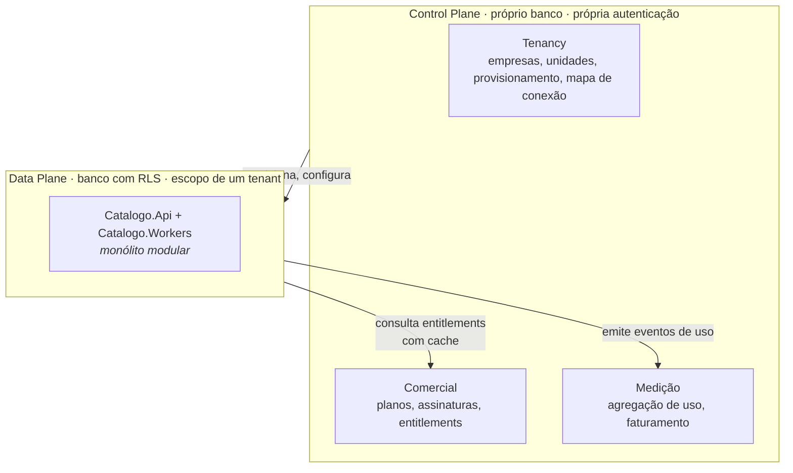

# ADR-0006 — Separar control plane do data plane; começar como monólito modular extraível

- **Status:** proposto
- **Data:** 2026-09-22
- **Relacionados:** ADR-0001, ADR-0008, ADR-0010, ADR-0011

## Contexto

O objetivo declarado inclui "exposição de API e monetização pelos microsserviços
usados". Há duas perguntas embutidas aí, e elas têm respostas diferentes:

1. **Onde estão as fronteiras?** — respondida pelos contextos delimitados
   (ADR-0001 e `ARQUITETURA.md` §3).
2. **Quantos processos implantáveis existem?** — é o que este ADR decide.

Confundir as duas é o erro mais caro em projetos deste porte. A fronteira que
importa para manutenibilidade e baixo acoplamento é a **lógica**; a fronteira de
rede só acrescenta custo — latência, falha parcial, consistência eventual,
rastreamento distribuído, versionamento de contrato interno — e só se paga quando
há um motivo mensurável.

Estado real do projeto: **~7.500 linhas**, equipe pequena, produto ainda sem o
primeiro cliente multiempresa. Nesse ponto, dez microsserviços não produzem
escalabilidade; produzem um monólito distribuído com latência de rede entre os
módulos e transação distribuída onde antes havia `COMMIT`.

Por outro lado, há **uma** fronteira que precisa ser de rede desde o dia 1, e por
motivo de segurança, não de escala.

## Decisão

### 1. Control plane e data plane são sistemas separados — desde o dia 1



Por que é obrigatório separar:

- **O control plane conhece todas as empresas; o data plane conhece uma.** Juntá-los
  colocaria, no mesmo processo e no mesmo pool de conexões, código que precisa
  atravessar tenants e código que jamais pode. Isso anula boa parte da proteção do
  ADR-0003.
- Bancos separados, credenciais separadas, superfícies de ataque separadas.
- O control plane tem **outro ritmo**: muda pouco, precisa de disponibilidade alta
  e tem tráfego baixo. O data plane muda toda semana.
- No tier Soberano (ADR-0003), há N data planes e **um** control plane. Se
  estivessem juntos, esse tier seria impossível sem fork.

O data plane consulta entitlements por **cache local com TTL curto e falha aberta
para leitura, fechada para escrita**: se o control plane cair, ninguém perde acesso
de consulta, mas criação de novo ativo acima da cota é bloqueada.

### 2. O data plane começa como monólito modular

Um processo de API (`Catalogo.Api`) e um de workers (`Catalogo.Workers`), com os
contextos como **módulos isolados dentro do mesmo deployable**:

```
Catalogo.Api            ← um processo
 ├── Modulo.Catalogo     ← Dominio + Aplicacao + Adaptadores próprios
 ├── Modulo.Governanca
 ├── Modulo.Qualidade
 ├── Modulo.Descoberta
 ├── Modulo.Notificacoes
 └── Modulo.Indicadores
```

Regras de isolamento, todas verificadas por teste de arquitetura (ADR-0001):

1. **Nenhum módulo referencia o `Dominio` ou o `Aplicacao` de outro.** A referência
   permitida é apenas a um projeto `*.Contratos` (comandos, consultas e eventos
   públicos daquele módulo).
2. **Nenhum módulo consulta tabela de outro módulo.** Mesmo banco, schemas
   separados, e a role da aplicação só tem `GRANT` no schema do próprio módulo.
   É o que impede o `JOIN` de conveniência que mata o modular monolith.
3. **Comunicação entre módulos é por evento de domínio** (ADR-0008) ou por uma
   porta explícita quando for consulta síncrona inevitável.

A regra 2 é a que costuma ser esquecida, e é a mais importante: sem `GRANT`
separado, o isolamento é só boa vontade. Com ele, o acoplamento indevido falha em
tempo de execução no primeiro teste de integração.

Ganho concreto: a extração futura vira **troca de adaptador**. O caso de uso que
publicava um evento no barramento em processo passa a publicá-lo no Service Bus;
nada da regra de negócio muda.

### 3. Ordem de extração, com critério

Extrair **só quando houver motivo mensurável**, e nesta ordem:

| Ordem | Módulo | Motivo | Gatilho objetivo |
|---|---|---|---|
| 1 | **Notificações** | Acoplamento quase zero; já é outbox | Volume ou canais (e-mail, Teams, webhook) justificarem cadência própria |
| 2 | **Descoberta** | I/O externo longo e imprevisível (OpenAPI, Git); falha isolada | Job de descoberta passar de ~10 min ou derrubar latência da API |
| 3 | **Qualidade** | CPU-bound, recálculo em lote | Recálculo global passar de 5 min ou competir com o caminho de escrita |
| 4 | **Indicadores** | Perfil de leitura muito distinto | Dashboard competir por conexão com o OLTP |
| — | **Catálogo + Governança** | **Nunca separar um do outro** | São o mesmo agregado conceitual; separar cria transação distribuída no `submeter` |

O item de baixo é o mais importante: `servicos.submeter` grava revisão, abre
validações e enfileira notificação **na mesma transação**. Separar Catálogo de
Governança transformaria isso numa saga, com compensação, para resolver um problema
que não existe.

### 4. Monetização não exige microsserviço

A frase "monetização pelos microsserviços usados" merece ser desmontada: o que se
cobra são **capacidades de produto** (descoberta automática, exportação, API
pública, volume de ativos), não processos Linux. Um módulo dentro do monólito pode
ter sua própria medição, seu próprio entitlement e seu próprio SKU — a unidade
comercial é o **módulo**, não o container (ADR-0010).

Isso é libertador: o roadmap comercial deixa de depender do roadmap de
infraestrutura.

## Consequências

### Positivas

- Uma transação onde hoje há uma transação; nenhuma saga prematura.
- Um deploy, um log correlacionado, um debug local — com um time pequeno, isso é a
  diferença entre entregar e não entregar.
- A fronteira crítica de segurança (control/data plane) está isolada desde o dia 1,
  que é quando custa barato.
- Extrair depois é barato porque a fronteira lógica já existe e é testada.

### Negativas

- **Escala é do processo inteiro**, não por módulo. Um pico na Descoberta consome
  recurso da API. Mitigado parcialmente por workers separados e por escala
  horizontal no Container Apps.
- **Um deploy afeta todos os módulos.** Exige suíte de testes confiável e
  *feature flags* por módulo.
- **Disciplina é obrigatória.** Sem as três regras de isolamento com teste
  automatizado, o modular monolith degenera em monólito em seis meses. Este é o
  risco real deste ADR.
- Dois sistemas (control + data) desde o início é mais infraestrutura do que um.

### Neutras / a monitorar

- Razão entre linhas de código no maior módulo e no menor. Se o Catálogo passar de
  10× o segundo maior, provavelmente está absorvendo responsabilidade alheia.
- Frequência de PRs que tocam mais de um módulo. Acima de ~30%, as fronteiras estão
  no lugar errado — e essa é a evidência de que se precisa de outro desenho, não de
  mais containers.

## Alternativas consideradas

**Microsserviços desde o dia 1, um por contexto.** Atende à leitura literal do
requisito. Recusada: 7.500 linhas e time pequeno; produziria latência de rede,
consistência eventual e transação distribuída para resolver problemas de escala que
ainda não existem, enquanto os problemas reais (multi-tenancy, identidade,
metamodelo, cobrança) ficariam sem atenção.

**Monólito único, com control plane dentro.** Mais simples. Recusada: anula a
separação de privilégio do ADR-0003 e inviabiliza o tier Soberano.

**Serverless puro (Azure Functions por caso de uso).** Escala a zero e custo por
execução. Recusada como padrão: partida a frio no caminho da API interativa, e
dificuldade de manter agregado rico entre funções. Usada pontualmente onde cabe
(gatilhos agendados).

**Arquitetura baseada em plugins, com módulos carregados em runtime.** Permitiria
vender módulos como add-ons instaláveis. Recusada por ora: complexidade de
carregamento e versionamento alta demais para o ganho; o mesmo efeito comercial se
obtém com entitlements (ADR-0010).

## Revisitar quando

- Qualquer gatilho da tabela de extração disparar.
- O time passar de ~8 pessoas em desenvolvimento simultâneo no data plane — aí o
  custo de coordenação num deployable começa a superar o custo do distribuído.
- Um cliente exigir SLA diferenciado para um módulo específico.
