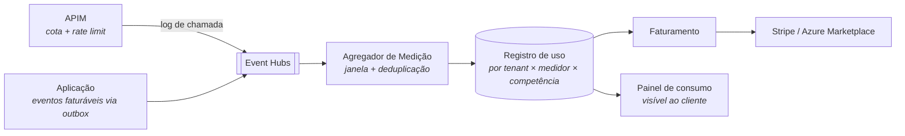

# ADR-0010 — Monetizar por plano + entitlements na aplicação, com medição de uso para cobrança variável

- **Status:** proposto
- **Data:** 2026-09-22
- **Relacionados:** ADR-0003, ADR-0006, ADR-0008, ADR-0009

## Contexto

O objetivo inclui "monetização pelos microsserviços usados". Vale traduzir isso
para o que o cliente efetivamente compra, porque a diferença muda a arquitetura:

- Nenhuma empresa compra "o microsserviço de descoberta". Ela compra **descoberta
  automática de ativos a partir de OpenAPI e Git**.
- Ninguém paga por "chamadas ao container de qualidade". Paga por **quantos ativos
  estão sob governança**.

A unidade comercial é a **capacidade de produto**, não o processo Linux. Isso
libera o roadmap comercial do roadmap de infraestrutura — dá para vender um módulo
novo sem extrair um serviço, e dá para extrair um serviço sem mexer no preço
(coerente com o ADR-0006).

O que já existe e serve de insumo:
- `auditoria_evento` registra toda ação com ator, origem e correlação;
- `integracoes.py` separa descoberta automática de cadastro manual — **é um módulo
  cobrável já isolado**;
- `snapshot_indicador` materializa indicadores por competência — a mesma mecânica
  de agregação por período que o faturamento precisa;
- `item_catalogo.origem` distingue `manual` de `automatica`, o que permite precificar
  descoberta sem instrumentação nova.

O que não existe: noção de plano, de limite, de consumo e de fatura.

## Decisão

### 1. Três eixos de receita

| Eixo | Cobrado sobre | Onde é imposto |
|---|---|---|
| **Assinatura** | Plano da empresa (mensal/anual) | Control plane |
| **Capacidade** | Limites de negócio: ativos, unidades, usuários, módulos ligados | **Aplicação** (entitlement) |
| **Consumo** | Chamadas de API, execuções de descoberta, exports | **Gateway + medição** |

O eixo do meio é o que costuma ser esquecido: **um gateway não sabe quantos ativos
existem no catálogo.** Limite de negócio tem que ser verificado no caso de uso, e
por isso o entitlement é um conceito de domínio, não de infraestrutura.

### 2. Plano → entitlements

```jsonc
{
  "plano": "profissional",
  "limites": {
    "ativos_sob_governanca": 5000,
    "unidades": 25,
    "usuarios_ativos": 100,
    "chamadas_api_mes": 250000
  },
  "modulos": {
    "descoberta_openapi": true,
    "descoberta_git": true,
    "webhooks": true,
    "sso_federado": true,
    "indicadores_avancados": false,
    "metamodelo_customizado": true     // ADR-0005
  },
  "isolamento": "padrao"               // padrao | dedicado | soberano (ADR-0003)
}
```

Esboço de grade — os números são ilustrativos e devem sair de pesquisa de mercado,
não deste documento:

| | Essencial | Profissional | Corporativo |
|---|---|---|---|
| Ativos sob governança | 500 | 5.000 | ilimitado |
| Unidades | 3 | 25 | ilimitado |
| Descoberta automática | — | ✓ | ✓ |
| SSO federado | — | ✓ | ✓ |
| Metamodelo customizado | — | ✓ | ✓ |
| API pública | 10k/mês | 250k/mês | 2M/mês + excedente |
| Isolamento | Padrão | Padrão | Dedicado ou Soberano |
| SLA | — | 99,5% | 99,9% |

Note que **isolamento é item de grade**. O tier Dedicado do ADR-0003 tem custo real
e mensurável; ele precisa aparecer no preço, senão vira prejuízo por cliente.

### 3. Entitlement é verificado no domínio

```csharp
// Catalogo.Aplicacao.Portas
public interface IEntitlements
{
    Task<Limite> ObterLimiteAsync(RecursoLimitado recurso, CancellationToken ct);
    Task<bool>   ModuloHabilitadoAsync(Modulo modulo, CancellationToken ct);
}

// no caso de uso
public async Task<Resultado> ExecutarAsync(CadastrarAtivo cmd, CancellationToken ct)
{
    var limite = await _entitlements.ObterLimiteAsync(RecursoLimitado.AtivosSobGovernanca, ct);
    var atuais = await _ativos.ContarAsync(ct);
    if (atuais >= limite.Maximo)
        return Resultado.Recusado(MotivoDeRecusa.LimiteDoPlanoAtingido(limite));
    // ...
}
```

Três decisões de comportamento que evitam desastre comercial:

- **Aviso antes do bloqueio.** A 80% e a 95% do limite, o evento
  `LimiteQuaseAtingido` dispara notificação (ADR-0008) e banner na UI. Bloquear sem
  aviso destrói confiança e gera churn.
- **Falha aberta para leitura, fechada para escrita.** Se o control plane estiver
  indisponível, ninguém perde acesso de consulta; criação acima da cota é negada.
- **Excedente antes de parede.** Para consumo de API, cobrar excedente é melhor que
  derrubar a integração do cliente em produção. Plano decide qual comportamento vale.

### 4. Medição



Medidores iniciais:

| Medidor | Unidade | Fonte |
|---|---|---|
| `api.chamadas` | requisição | Log do APIM |
| `catalogo.ativos_governados` | máximo do período | Snapshot diário |
| `descoberta.execucoes` | execução | Evento `DescobertaImportada` |
| `descoberta.ativos_descobertos` | ativo | `item_catalogo.origem = 'automatica'` |
| `exportacao.documentos` | documento | Evento de export |
| `usuarios.ativos` | pessoa distinta no mês | Evento de autenticação |

Requisitos não negociáveis da medição, porque o resultado vira fatura:

- **Idempotência** por `(tenant, medidor, chave_do_evento)`. Duplicar evento é
  cobrar a mais — e cobrar a mais custa mais caro que cobrar a menos.
- **Imutabilidade**: registro de uso fechado não é editado; ajuste é lançamento de
  crédito, com motivo e autor. É o mesmo princípio de `revisao_catalogo`.
- **Transparência**: o cliente vê o consumo em tempo quase real, com o mesmo
  detalhe que a fatura. Disputa de fatura sem painel é suporte garantido.
- **Reconciliação diária** entre APIM, Event Hubs e registro de uso, com alerta em
  divergência acima de 0,1%.

Em volume alto, o destino é **Azure Data Explorer**; abaixo disso, tabela
particionada no Postgres com `pg_partman` resolve (ADR-0004). Comece pela tabela.

### 5. Cobrança

- **Stripe** para venda direta: assinatura, medidor de uso, fatura, dunning,
  impostos. Não construa isso.
- **Oferta SaaS no Azure Marketplace** com *custom meters* para clientes que
  preferem comprar pelo compromisso Azure já existente — canal de venda relevante
  em B2B corporativo, e frequentemente decisivo na aprovação de compra.
- **Fatura manual** para o tier Corporativo/Soberano, com contrato negociado.

O APIM entra como camada de empacotamento: cada Product = um plano, com `quota` e
`rate-limit-by-key`, e *delegation* para o fluxo de assinatura no portal do
desenvolvedor (ADR-0009).

### 6. Trial e conversão

Trial de 30 dias no plano Profissional, **sem cartão**, com limites do Essencial.
Ao expirar, a conta vira somente-leitura por 60 dias antes de qualquer expurgo —
catálogo corporativo é memória institucional, e apagar dado de cliente que atrasou
pagamento é a forma mais rápida de destruir reputação num mercado pequeno.

## Consequências

### Positivas

- Receita cresce com o valor entregue (ativos governados), não com o custo de
  infraestrutura.
- O módulo de descoberta — o de maior custo de execução — é diretamente cobrável.
- O eixo de isolamento transforma a complexidade do ADR-0003 em receita, em vez de
  prejuízo.
- Dá para vender capacidade nova sem mudar a topologia de serviços.

### Negativas

- **Medição correta é difícil.** Duplicidade, perda, relógio, fuso e fechamento de
  competência são fonte crônica de bug com impacto financeiro direto.
- **Verificação de entitlement no caminho crítico** adiciona latência. Exige cache
  agressivo com invalidação por evento de mudança de plano.
- **Complexidade de teste**: cada combinação plano × limite × módulo é um caminho.
  Exige matriz de teste e não dá para cobrir na unha.
- **Risco reputacional** em bloqueio indevido. Cada regra de bloqueio precisa de
  interruptor de emergência por tenant.

### Neutras / a monitorar

- Precificação é decisão de negócio; este ADR fixa a **arquitetura** que suporta
  qualquer grade, não a grade em si.
- `auditoria_evento` não deve virar fonte de faturamento (propósito diferente,
  retenção diferente). Fonte de faturamento é a outbox de eventos faturáveis.
- Vigiar a margem por cliente: no tier Padrão ela é alta; no Soberano pode ser
  negativa se o preço não cobrir o stamp. Relatório mensal de custo por tenant
  (ADR-0011) é insumo obrigatório.

## Alternativas consideradas

**Preço único por usuário (per seat).** Simples de entender e vender. Recusada como
eixo principal: um catálogo corporativo tem poucos curadores e muitos leitores;
cobrar por assento desincentiva justamente a adoção ampla que dá valor ao produto.
Entra como limite secundário, não como base.

**Somente consumo (pay-as-you-go puro).** Alinha preço e valor perfeitamente.
Recusada como eixo principal: receita imprevisível para o fornecedor e fatura
imprevisível para o cliente — e comprador corporativo rejeita fatura imprevisível.

**Cobrar por microsserviço, literalmente.** Recusada pelos motivos do Contexto:
amarra o modelo comercial à topologia técnica, e o cliente não entende o que compra.

**Open core (núcleo aberto, módulos fechados).** Estratégia legítima, e o projeto
já é MIT. Recusada por ora: exige governança de comunidade e disciplina de licença
que o momento não comporta. Fica registrada como opção futura — vale um ADR próprio
se for considerada.

**Construir faturamento próprio.** Recusada sem hesitação: imposto, dunning,
conciliação e conformidade fiscal são um produto inteiro. Use Stripe.

## Revisitar quando

- A receita de consumo passar de ~30% do total — reavaliar a grade inteira.
- Taxa de disputa de fatura passar de 2% — problema de transparência, não de preço.
- Três ou mais clientes pedirem preço por ativo em vez de por plano.
- O canal Azure Marketplace passar de 20% da receita — vale investir em
  co-sell e otimizar a oferta.
