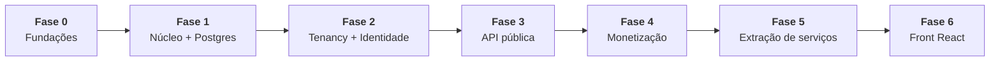

# ADR-0012 — Migrar por Strangler Fig, usando a suíte pytest atual como especificação executável

- **Status:** proposto
- **Data:** 2026-09-22
- **Relacionados:** todos

## Contexto

A migração é de Python/Flask/SQLite para .NET/Azure/PostgreSQL (ADR-0002), com
mudança simultânea de arquitetura (ADR-0001), de modelo de dados (ADR-0003, 0004)
e de metamodelo (ADR-0005). É reescrita. Reescrita tem uma taxa de fracasso alta e
uma causa dominante: **o conhecimento tácito que só existe no código antigo se
perde**.

Neste projeto, felizmente, boa parte desse conhecimento está escrita — só não em
prosa:

```
tests/test_governanca.py     175 linhas   regras de publicação e ciclo de vida
tests/test_fluxo.py          345 linhas   fluxo de trabalho fim a fim
tests/test_acesso.py         458 linhas   RBAC, escopo, segregação de função
tests/test_acesso_pleito.py  387 linhas   fluxo de concessão de papel
tests/test_escala.py         427 linhas   descoberta automática, paginação, mapas
tests/test_jornada.py        238 linhas   navegação e UI
tests/test_cartilha.py       174 linhas   a cartilha deriva de PERMISSOES, não é copiada
                           ─────────
                           2.204 linhas de especificação executável
```

São 2.204 linhas de teste para 5.232 linhas de aplicação — quase 1:2. Esses testes
descrevem o comportamento esperado com precisão maior do que qualquer documento.
`test_cartilha.py` é especialmente revelador: ele verifica que a documentação
continua *derivada* de `acesso.PERMISSOES`, e não copiada à mão. Isso é uma regra
de arquitetura codificada em teste — a mesma ideia que o ADR-0001 generaliza.

## Decisão

### 1. Os testes são portados **antes** do código que eles cobrem

Para cada regra migrada:

1. Ler o teste em Python e extrair o **caso**: entradas, ação, resultado esperado.
2. Escrever o teste equivalente em xUnit contra a API alvo. **Ele falha** (o código
   ainda não existe).
3. Implementar a regra em C# até o teste passar.
4. **Executar os dois sistemas em paralelo** com a mesma entrada e comparar a saída
   (*shadow comparison*), até que a diferença seja zero ou explicada.

O passo 4 é o que separa migração de reescrita esperançosa. Para as regras
centrais — `pre_check`, `pode`, `pode_decidir`, `avaliar` (score) — há uma técnica
mais barata e mais forte: extrair os casos para **arquivos de dados compartilhados**
e rodar a mesma tabela nos dois sistemas.

```yaml
# testes/casos/pre-check.yaml — consumido pelo pytest E pelo xUnit
- nome: "score abaixo do mínimo bloqueia publicação"
  ativo:    { tipo: api, criticidade: alta, tem_owner: true, evidencias: 2 }
  politica: { score_minimo: 70, evidencia_minima: 1 }
  score:    54
  espera:   { aprovado: false, bloqueios: [SCORE_ABAIXO_DO_MINIMO] }
```

Divergência entre implementações deixa de ser discussão e vira teste vermelho. E o
arquivo sobrevive à migração: ele vira a suíte de regressão permanente do C#.

### 2. Ordem de migração — do miolo para a borda



| Fase | Entrega | Testes portados | O Flask… |
|---|---|---|---|
| **0** | Repo .NET, CI, Terraform `dev`, Aspire local, ADRs aceitos | — | segue no ar, intocado |
| **1** | `Catalogo.Dominio` + `Aplicacao`; Postgres com RLS; dados migrados; API `/v1` paridade | `test_governanca`, `test_acesso`, `test_acesso_pleito` | é desligado no fim da fase |
| **2** | Control plane, Entra External ID, federação, metamodelo por tenant | `test_cartilha` | — |
| **3** | Contrato v1, APIM, portal, planos e cotas | `test_escala` (paginação, descoberta) | — |
| **4** | Entitlements, medição, cobrança | novos | — |
| **5** | Descoberta e Notificações extraídas | `test_fluxo` | — |
| **6** | SPA React; Jinja aposentado | `test_jornada` → Playwright | — |

**Por que o miolo primeiro.** A tentação é migrar a UI antes, porque é visível. É o
caminho errado: a UI é a camada que menos arrisca dado e a que mais muda de forma.
Migrar governança e autorização primeiro ataca o risco real — perder uma regra —
enquanto o Jinja continua funcionando e provando que o motor novo está certo.

### 3. Estrangulamento na Fase 1

Durante a Fase 1, os dois sistemas coexistem atrás de um proxy que roteia por rota:

```
                 ┌─────────────┐
 requisição ───► │  Proxy/APIM │
                 └──────┬──────┘
                        ├── /api/v1/precheck, /validacoes  ──► .NET  (migrado)
                        └── todo o resto                   ──► Flask (legado)
```

Por rota, e não por usuário ou por percentual: com um banco só como fonte da
verdade nessa fase, rota é a granularidade que não produz estado dividido.

Regra dura: **em nenhum momento os dois sistemas escrevem na mesma tabela.** Assim
que uma rota de escrita migra, a rota antiga é desligada, não mantida "por
segurança". Escrita dupla é como se produz corrupção silenciosa.

### 4. Migração de dados

Instalações existentes são poucas e pequenas (SQLite local), então o processo é
simples — o que não significa descuidado.

```
1. Exportar cada catalogo.db para JSON canônico (script Python, no repo legado)
2. Atribuir tenant_id: cada instalação vira uma empresa
3. Derivar unidades a partir de pessoa.unidade (o campo de 4 dígitos já existe)
4. Transformar:
   - datas TEXT       → TIMESTAMPTZ (assumir America/Sao_Paulo, documentar)
   - atributos TEXT   → JSONB, validado contra o metamodelo padrão (ADR-0005)
   - ids sequenciais  → manter internos + gerar codigo_publico UUID v7
   - payload_hash     → revalidar TODOS; divergência interrompe a migração
5. Carregar no Postgres com RLS ativo (a carga roda com tenant_id setado)
6. Verificar:
   - contagem por tabela: origem == destino
   - hash de todas as revisões: reconferido
   - score de qualidade recalculado == score armazenado
   - amostra de 50 ativos com visão 360 comparada campo a campo
7. Congelar o SQLite como somente-leitura por 90 dias
```

O passo 4 sobre `payload_hash` é o mais valioso: o projeto já grava hash SHA-256 de
cada revisão. Revalidar todos na migração prova que nenhum byte se perdeu — é uma
verificação de integridade que a maioria das migrações não tem porque a maioria dos
sistemas não gravou o hash. Aqui, gravou.

O passo 6 é critério de corte: qualquer divergência aborta e a migração é refeita.

### 5. O que **não** se migra

Decidir isso explicitamente evita carregar peso morto:

| Item | Destino |
|---|---|
| `db.MIGRACOES` | Substituído por EF Core Migrations (ADR-0004) |
| Templates Jinja | Referência visual para o React; o código não migra |
| `estilo.css` (tokens de tema claro/escuro) | **Migra** — é bom e já tem teste garantindo que não há cor fixa |
| `scripts/publicar-no-github.sh` | Substituído pelo pipeline (ADR-0011) |
| `seed.py` | Vira *seed* de demonstração do control plane; a lógica se aproveita |
| `docs/MODELO.md` | **Preservar** — vira a especificação do metamodelo padrão v1 |
| `docs/CARTILHA.md` | **Preservar** — e manter derivado das permissões, como `test_cartilha` exige |

### 6. Critérios de conclusão por fase

Nenhuma fase é declarada pronta sem:

- [ ] todos os testes portados daquela fase passando;
- [ ] shadow comparison com divergência zero (ou divergências explicadas e aceitas por escrito);
- [ ] teste de carga com o volume do maior cliente atual × 10;
- [ ] teste de isolamento entre empresas passando (ADR-0003);
- [ ] runbook de rollback escrito **e ensaiado**;
- [ ] documentação atualizada no mesmo PR.

## Consequências

### Positivas

- Os 2.204 testes atuais viram a rede de proteção da migração, em vez de serem
  descartados com o código.
- Cada fase entrega algo em produção; não há vale de seis meses sem valor.
- O risco maior — perder regra de negócio — é atacado primeiro, quando o custo de
  corrigir ainda é baixo.
- A verificação por hash dá garantia objetiva de integridade dos dados migrados.

### Negativas

- **Período de dois sistemas** na Fase 1: dois deploys, dois logs, dois ambientes.
  Desconfortável e é onde a maioria das migrações trava. Mitigação: Fase 1 curta e
  com escopo fechado.
- **Portar teste é trabalho que não gera funcionalidade nova.** Precisa ser
  defendido junto a quem cobra entrega.
- **Casos compartilhados em YAML** adicionam uma camada de indireção nos testes.
  O ganho compensa apenas nas regras centrais; não generalize.
- O custo total é alto e deve ser dito com clareza no planejamento, não descoberto
  no meio.

### Neutras / a monitorar

- Se a Fase 1 se arrastar além do previsto, o sinal é claro: a curva de C#
  (ADR-0002) foi subestimada. Reabra o ADR-0002 com dados em vez de insistir.
- Manter o repositório Python acessível (branch `legado`) por pelo menos um ano.
  É a única forma de responder "como isso funcionava antes?".

## Alternativas consideradas

**Big bang: reescrever tudo e trocar num fim de semana.** Mais rápido no papel.
Recusada: sem período de comparação, qualquer regra perdida só aparece em produção,
e o rollback é voltar meses de trabalho.

**Migrar a UI primeiro.** Mais visível para quem patrocina. Recusada: entrega
percepção de progresso sem reduzir risco, e exige manter duas UIs sobre a mesma
regra.

**Manter Flask e só adicionar os componentes novos em .NET.** Poliglotismo
permanente. Recusada: duas stacks para sempre, duas implementações de autorização,
e a regra de negócio acabaria duplicada nas duas — o pior dos cenários.

**Executar os dois sistemas em produção lado a lado por meses.** Segurança máxima.
Recusada: escrita dupla ou sincronização bidirecional, que é justamente onde a
corrupção silenciosa nasce.

## Revisitar quando

- A Fase 1 passar de 150% do prazo estimado.
- A divergência de shadow comparison estabilizar acima de 1% sem explicação.
- Surgir um cliente com prazo que não caiba no roteiro — aí a conversa é sobre
  escopo, não sobre pular fases.
